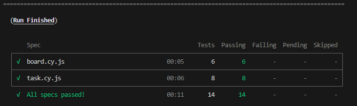
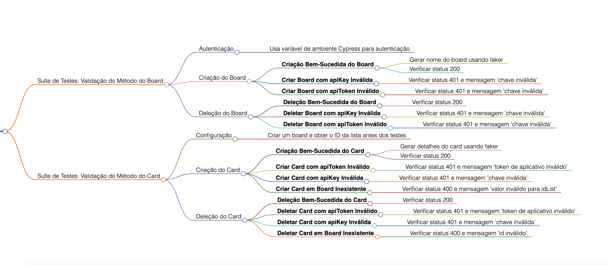

# Desafio para vaga de QA
[](https://www.cypress.io/)

## Introdução
O Projeto foi construído utilizando a arquitetura padrão gerada pelo cypress, os testes se concentram dentro da pasta e2e/api, e contemplam todos os cenários solicitados pelo desafio, foi utilizado o [faker](https://www.npmjs.com/package/@faker-js/faker), para gerar randomicamente a massa de dados enviada nos testes.

## Execução

### Pré-Requisitos

- [Git](https://git-scm.com/download/) e [Node.js](https://nodejs.org/en/download/) instalado.

### Instalando as dependências e executando os testes

Todos os comandos abaixo são executados pelo _prompt de comando_.

**1** - Clone o repositório e acesse o diretório criado:

```sh
git clone https://github.com/pedrohnsc2/desafio-serasa-qa.git
```

**2** - Instale as depedências necessárias para rodar os testes:

```sh
npm install
```

**3** - Você pode escolher rodar os testes no modo com interface gráfica(GUI) ou em Headless, para rodar com o GUI, digite o seguinte comando e depois disso escolha qual spec você quer rodar:

```sh
npm run open
```

**4** - Para rodar o modo Headless, digite:

```sh
npm run cypress:run
```
---



### Mapa mental da solução


[Licença MIT](/LICENSE)
